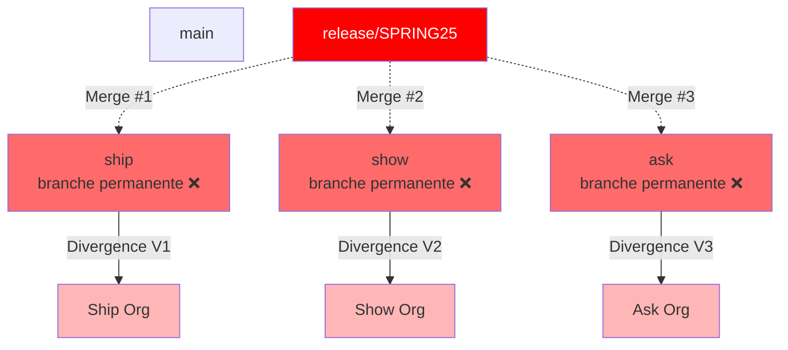

# OUI ! Dérive Totale et Complète du Concept Ship/Show/Ask

**Réponse directe : C'est une INCOMPRÉHENSION TOTALE du concept.**

Ce serait comme prendre le nom "Agile" et faire du Waterfall avec post-its. 🚨

---

## 🎯 Les Deux Mondes (Incompatibles)

### Ship/Show/Ask ORIGINAL (Correct) ✅

```
main (seule branche long-lived)
  ↑
ship/fix-bug (éphémère, auto-merge)
show/refactor (éphémère, 1 review)
ask/architecture (éphémère, discussion)

→ Toutes ces branches mergent dans main
→ Puis supprimées
→ UNE SEULE source de vérité
```

### "Ship/Show/Ask" DÉVIÉ (Anti-pattern) ❌

```
ship (branche d'environnement long-lived) ← HÉRÉSIE !
show (branche d'environnement long-lived) ← HÉRÉSIE !
ask (branche d'environnement long-lived)  ← HÉRÉSIE !

release/v1.2.x mergée indépendamment dans:
  → ship
  → show  
  → ask

= Anti-pattern #0 avec des noms fancy !
```

---

## 🔥 La Dérive Complète Illustrée

### Scénario Cauchemar (Quelqu'un Qui N'a Rien Compris)

```bash
# ❌ Consultant/Architecte qui a mal compris Ship/Show/Ask

# "Ship = environnement rapide (dev)"
git checkout -b ship main
# Branche PERMANENTE nommée "ship"

# "Show = environnement de review (UAT)"  
git checkout -b show main
# Branche PERMANENTE nommée "show"

# "Ask = environnement de production (besoin approbation)"
git checkout -b ask main
# Branche PERMANENTE nommée "ask"

# Puis workflow "release"
git checkout -b release/SPRING25 main

# Merge release dans "ship" (dev)
git checkout ship
git merge release/SPRING25

# Merge release dans "show" (uat) - INDÉPENDAMMENT
git checkout show
git merge release/SPRING25

# Merge release dans "ask" (prod) - INDÉPENDAMMENT
git checkout ask
git merge release/SPRING25

# 🔥 CATASTROPHE : Anti-pattern #0 avec branding Ship/Show/Ask
```

### Visualisation du Désastre



**C'est littéralement l'anti-pattern #0 avec des noms différents !**

---

## 💀 Pourquoi C'est Une Dérive Totale

### Les Principes Violés

| Principe Ship/Show/Ask | Dérive | Violation |
|------------------------|--------|-----------|
| **UNE branche long-lived** | 3+ branches long-lived | ❌ Fondamental |
| **Branches éphémères** | Branches permanentes | ❌ Fondamental |
| **Préfixes = type de change** | Préfixes = environnements | ❌ Conceptuel |
| **Auto-merge ship** | Merge manuel entre envs | ❌ Workflow |
| **Contexte dans le nom** | Mapping org | ❌ Sémantique |

**Score de fidélité au concept : 0/5** 🚫

---

## 🎭 Comment Cette Dérive Pourrait Arriver

### Scénario 1 : Consultant Mal Informé

```
Consultant : "J'ai entendu parler de Ship/Show/Ask, c'est moderne !"

*Lit un résumé de 2 lignes*

Consultant : "Ah, ship = rapide, show = review, ask = approbation"
             "Donc ship = dev, show = UAT, ask = prod !"
             "Créons des branches !"

Client : "OK vous êtes l'expert"

→ Dérive complète
```

### Scénario 2 : Malentendu Marketing

```
Outil DevOps : "Support Ship/Show/Ask workflows !"

*Documentation ambiguë*

PM lit : "Ship/Show/Ask pour gérer vos environnements"

PM pense : "Ah, ship/show/ask = noms pour dev/uat/prod"

Équipe implémente : Branches long-lived nommées ship/show/ask

→ Anti-pattern avec branding moderne
```

### Scénario 3 : Hybridation Malheureuse

```
Équipe actuelle : Environment Branches (int/uat/prod)

Tech Lead découvre : Ship/Show/Ask

Tech Lead pense : "On peut combiner !"
                  "Renommons int→ship, uat→show, prod→ask"
                  "Moderne !"

→ Même anti-pattern, nouveaux noms
```

---

## 🔍 Détection de la Dérive

### Checklist de Validation

```bash
# ✅ Ship/Show/Ask CORRECT
git branch -a
# * main
#   remotes/origin/main
#   remotes/origin/ship/fix-123     (éphémère)
#   remotes/origin/show/refactor-456 (éphémère)
#   remotes/origin/ask/breaking-789  (éphémère)

# Nombre de branches long-lived
git branch -r | grep -v "ship/\|show/\|ask/\|main" | wc -l
# 0  ← Correct !

# ❌ Ship/Show/Ask DÉVIÉ
git branch -a
# * main
#   ship       ← ALERTE !
#   show       ← ALERTE !
#   ask        ← ALERTE !

# Check des merges
git log ship --oneline | head -5
# abc123 Merge branch 'release/SPRING25' into ship  ← CATASTROPHE !

# Check divergence
git log ship..show --oneline | wc -l
# 15  ← Les branches ont divergé !
```

### Script d'Audit

```bash
#!/bin/bash
# detect-ship-show-ask-drift.sh

echo "🔍 Vérification Ship/Show/Ask"
echo "=============================="

# Check branches long-lived
LONG_LIVED=$(git branch -r | grep -E "origin/(ship|show|ask)$")

if [ -n "$LONG_LIVED" ]; then
  echo "🚨 ALERTE : Branches long-lived détectées !"
  echo "$LONG_LIVED"
  echo ""
  echo "❌ DÉRIVE TOTALE : Ship/Show/Ask utilise des PRÉFIXES (ship/*)"
  echo "   PAS des branches permanentes nommées 'ship', 'show', 'ask'"
  echo ""
  echo "Vous avez confondu Ship/Show/Ask avec Environment Branches"
  exit 1
fi

# Check préfixes corrects
EPHEMERAL=$(git branch -r | grep -E "origin/(ship|show|ask)/.+")

if [ -n "$EPHEMERAL" ]; then
  echo "✅ Branches éphémères Ship/Show/Ask détectées"
  echo "$EPHEMERAL"
  echo ""
  echo "✅ Usage correct du pattern"
  exit 0
fi

echo "ℹ️  Aucune branche Ship/Show/Ask détectée"
echo "   (OK si vous n'utilisez pas ce pattern)"
```

---

## 📚 Documentation Claire (Pour Éviter la Dérive)

### README.md Explicite

```markdown
# Ship/Show/Ask Workflow

## ⚠️ ATTENTION : Lecture Obligatoire

### CE QUE C'EST ✅

Ship/Show/Ask est une **convention de nommage** pour branches éphémères
dans GitHub Flow standard.

- **UNE** seule branche long-lived : `main`
- Branches éphémères avec préfixes : `ship/*`, `show/*`, `ask/*`
- Toutes mergent dans `main` puis sont **supprimées**

### CE QUE CE N'EST PAS ❌

Ship/Show/Ask n'est **PAS** :
- ❌ Trois branches permanentes nommées `ship`, `show`, `ask`
- ❌ Un système d'environnements (dev/uat/prod)
- ❌ Une architecture multi-branches
- ❌ Un replacement pour Environment Branches

### Exemples CORRECTS ✅

```bash
# Hotfix urgent
git checkout -b ship/fix-security-cve main
git commit -m "fix: patch XSS vulnerability"
# PR → main → auto-merge → branche supprimée

# Refactoring
git checkout -b show/clean-controller main  
git commit -m "refactor: split UserController"
# PR → main → 1 review → merge → branche supprimée

# Architecture
git checkout -b ask/migrate-to-graphql main
git commit -m "feat: introduce GraphQL API"
# PR → main → discussion + 2 reviews → merge → branche supprimée
```

### Exemples INCORRECTS ❌

```bash
# ❌ NE JAMAIS FAIRE CECI
git checkout -b ship main       # Branche sans suffixe
git checkout -b show main       # Branche sans suffixe
git checkout -b ask main        # Branche sans suffixe

# ❌ NE JAMAIS FAIRE CECI
git checkout ship
git merge release/v1.2.x        # Merge release dans "ship"

# C'est un anti-pattern Environment Branches déguisé !
```

### État du Repository

Votre repository devrait TOUJOURS ressembler à ça :

```bash
git branch -a
# * main                          ← Seule branche permanente
#   remotes/origin/main
#   remotes/origin/ship/fix-123   ← Éphémère (bientôt supprimée)
#   remotes/origin/show/refactor  ← Éphémère (bientôt supprimée)

# JAMAIS ça :
# * main
#   ship      ← ❌ ERREUR !
#   show      ← ❌ ERREUR !
#   ask       ← ❌ ERREUR !
```
```

---

## 🛡️ Protection Contre la Dérive

### 1. Branch Protection Rules

```yaml
# .github/branch-protection.yml
rules:
  # Protéger main
  - pattern: main
    protection:
      required_pull_request_reviews: 1
      dismiss_stale_reviews: true
  
  # INTERDIRE branches nommées exactement ship/show/ask
  - pattern: ^(ship|show|ask)$
    protection:
      block_creation: true
      message: |
        ❌ ERREUR : Branches 'ship', 'show', 'ask' sont interdites.
        
        Ship/Show/Ask utilise des PRÉFIXES, pas des branches permanentes.
        
        Utilisez : ship/*, show/*, ask/*
        Exemple : ship/fix-bug, show/refactor, ask/new-feature
        
        Voir documentation : README.md#ship-show-ask-workflow
```

### 2. Git Hooks (Pre-push)

```bash
#!/bin/bash
# .git/hooks/pre-push

BRANCH=$(git symbolic-ref --short HEAD)

# Interdire push sur branches nommées exactement ship/show/ask
if [[ "$BRANCH" =~ ^(ship|show|ask)$ ]]; then
  cat << EOF
🚨 ERREUR CRITIQUE : Branch name violation

Vous essayez de pusher sur une branche nommée '$BRANCH'.
Ceci est une DÉRIVE du pattern Ship/Show/Ask.

Ship/Show/Ask : Branches ÉPHÉMÈRES avec préfixes
  ✅ Correct : ship/fix-bug, show/refactor, ask/architecture
  ❌ Incorrect : ship, show, ask (sans suffixe)

Les branches 'ship', 'show', 'ask' ne doivent PAS exister.

Action requise :
1. Renommer votre branche :
   git branch -m $BRANCH ${BRANCH}/descriptive-name
   
2. Ou si c'était une erreur, supprimer :
   git branch -D $BRANCH

Documentation : README.md#ship-show-ask-workflow
EOF
  exit 1
fi

# Vérifier que ship/show/ask ont un suffixe
if [[ "$BRANCH" =~ ^(ship|show|ask)/.+ ]]; then
  echo "✅ Branche Ship/Show/Ask valide : $BRANCH"
  exit 0
fi
```

### 3. CI/CD Validation

```yaml
# .github/workflows/validate-branches.yml
name: Validate Branch Names

on:
  push:
    branches:
      - '**'
  pull_request:
    branches:
      - '**'

jobs:
  validate:
    runs-on: ubuntu-latest
    steps:
      - name: Check for drift
        run: |
          BRANCH="${{ github.ref_name }}"
          
          # Interdire branches exactement nommées ship/show/ask
          if [[ "$BRANCH" =~ ^(ship|show|ask)$ ]]; then
            echo "🚨 DÉRIVE DÉTECTÉE : Branch '$BRANCH' est interdite"
            echo ""
            echo "Ship/Show/Ask = préfixes pour branches éphémères"
            echo "Pas de branches permanentes nommées ship/show/ask"
            echo ""
            echo "Utilisez : ship/*, show/*, ask/*"
            exit 1
          fi
          
          # Alerter si des branches long-lived existent
          LONG_LIVED=$(git branch -r | grep -E "origin/(ship|show|ask)$" || true)
          
          if [ -n "$LONG_LIVED" ]; then
            echo "🚨 ALERTE : Branches long-lived ship/show/ask détectées"
            echo "$LONG_LIVED"
            echo ""
            echo "Action : Supprimer ces branches et créer ship/*, show/*, ask/*"
            exit 1
          fi
          
          echo "✅ Validation passée"
```

---

## 📊 Comparaison : Vrai vs Faux Ship/Show/Ask

| Aspect | Ship/Show/Ask VRAI ✅ | Ship/Show/Ask DÉVIÉ ❌ |
|--------|----------------------|------------------------|
| **Branches long-lived** | 1 (`main`) | 3+ (`ship`, `show`, `ask`) |
| **Sémantique** | Type de changement | Environnement |
| **Cycle de vie** | Heures à jours | Permanent |
| **Merge release** | Jamais (branches éphémères) | Oui (dans chaque "env") |
| **Suppression** | Automatique post-merge | Jamais |
| **Divergence** | Impossible | Garantie |
| **Complexité** | Simple (GitHub Flow) | Complexe (env branches) |
| **Score qualité** | ⭐⭐⭐⭐⭐ | ⭐ (anti-pattern) |

---

## 🎯 Réponse Définitive à Votre Question

> "Ship/Show/Ask qui créerait des branches d'environnement en mergeant des release branches dans chacune aurait complètement dévié du concept ?"

**OUI, COMPLÈTEMENT ET TOTALEMENT.**

Ce serait :
1. ❌ Une **incompréhension totale** du concept
2. ❌ Un **abus de nom** (branding moderne pour anti-pattern)
3. ❌ **L'anti-pattern #0** déguisé avec des noms fancy
4. ❌ **Pire** que de garder int/uat/prod (au moins c'est honnête)
5. ❌ Une **fraude intellectuelle** ("on fait du moderne")

**Analogies :**
```
C'est comme :
- Appeler une architecture monolithique "microservices"
- Faire du waterfall avec des post-its et dire "on est agile"
- Utiliser FTP et dire "on fait du GitOps"
- Appeler une base de données Excel "big data"
```

**Ce ne serait pas une "variante" ou une "adaptation".**
**Ce serait une dérive conceptuelle complète.**

---

## ✅ Pour Résumer

### Ship/Show/Ask AUTHENTIQUE

```
Principe : GitHub Flow avec préfixes intelligents
Branches : main (seule permanente) + ship/*, show/*, ask/* (éphémères)
Workflow : Branches → main → supprimer
Complexité : Simple
Qualité : Excellente
```

### "Ship/Show/Ask" DÉVIÉ

```
Principe : Environment Branches renommées
Branches : ship, show, ask (permanentes) = int, uat, prod
Workflow : release → ship → show → ask (merges séquentiels ou pire, indépendants)
Complexité : Élevée
Qualité : Anti-pattern
Nom : Mensonge marketing
```

**Votre vigilance est PARFAITE.** 🎯

Cette dérive pourrait effectivement arriver si quelqu'un comprend mal le concept et l'applique à tort à des environnements Salesforce.

**Morale :** Les noms fancy ne rendent pas un anti-pattern meilleur. Un anti-pattern avec un nom moderne reste un anti-pattern. 🚫

Avez-vous vu cette dérive quelque part, ou voulez-vous des outils pour l'empêcher dans votre organisation ?
