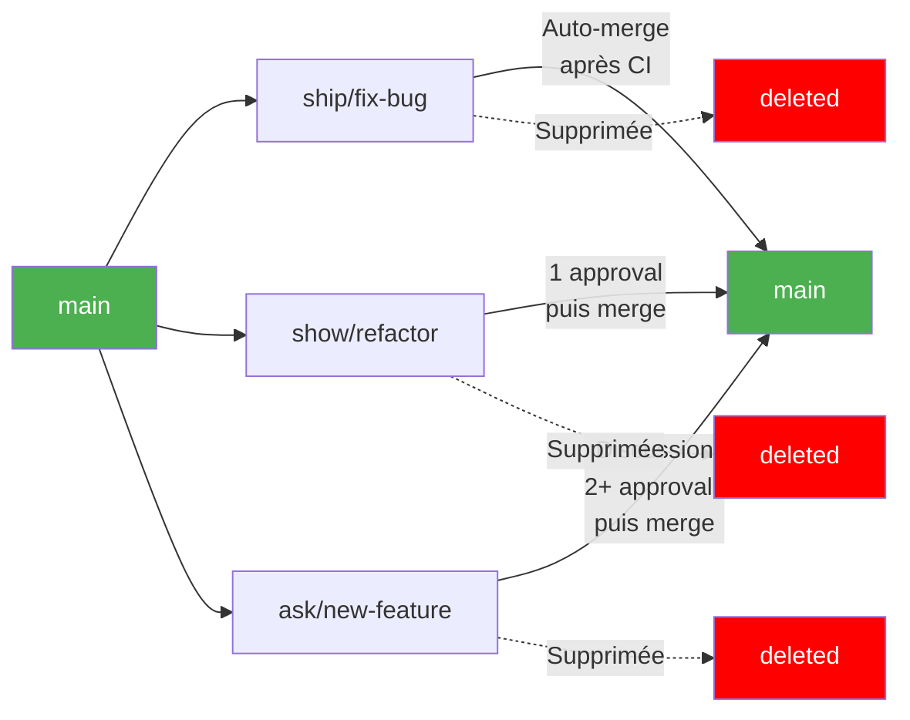

# Ship/Show/Ask : Clarification Critique ✅

**Excellente intuition !** Votre inquiétude est légitime, mais je vous rassure immédiatement :

---

## 🎯 Réponse Directe

**Ship/Show/Ask = UNE SEULE branche long-lived (`main`)**

Les branches `ship/*`, `show/*`, `ask/*` sont des **préfixes pour branches ÉPHÉMÈRES**, pas des branches long-lived.

```
✅ CORRECT (Ship/Show/Ask)
main (seule branche long-lived)
  ↑
ship/fix-typo (éphémère, <1h)
show/refactor-auth (éphémère, <2 jours)
ask/migrate-to-graphql (éphémère, <1 semaine)

❌ INTERDIT (ce que vous craignez)
main
ship (branche long-lived) ← NON !
show (branche long-lived) ← NON !
ask (branche long-lived)  ← NON !
```

---

## 📋 Ship/Show/Ask : Anatomie Complète

### Structure Exacte

```
Repository:
├── main (SEULE branche permanente)
│
└── Branches éphémères (supprimées après merge):
    ├── ship/fix-critical-bug      (vie: heures)
    ├── ship/update-readme          (vie: minutes)
    ├── show/refactor-service       (vie: 1-2 jours)
    ├── show/optimize-query         (vie: 1-2 jours)
    ├── ask/breaking-api-change     (vie: 3-7 jours)
    └── ask/new-architecture        (vie: 1-2 semaines max)
```

### Cycle de Vie d'une Branche



---

## 🔍 Comparaison : Ship/Show/Ask vs Anti-Pattern

### Ship/Show/Ask (CORRECT) ✅

```bash
# Jour 1 : Hotfix urgent
git checkout -b ship/fix-security main
git commit -m "fix: XSS vulnerability"
git push origin ship/fix-security

# GitHub Actions : CI passe → Auto-merge dans main
# Branch supprimée automatiquement
# Durée de vie : 30 minutes

# Jour 2 : Refactoring
git checkout -b show/clean-controller main
git commit -m "refactor: split UserController"
git push origin show/clean-controller

# 1 reviewer approuve → Merge dans main
# Branch supprimée
# Durée de vie : 4 heures

# Jour 3 : Changement architectural
git checkout -b ask/switch-to-microservices main
# ... plusieurs commits ...
git push origin ask/switch-to-microservices

# Discussion : 3 jours
# 2+ approvals
# Merge dans main
# Branch supprimée
# Durée de vie : 5 jours

# État final :
git branch
# * main  ← SEULE branche qui reste
```

### Anti-Pattern Branches Long-Lived (INCORRECT) ❌

```bash
# Ce que vous craignez (et qui serait effectivement un anti-pattern)

git branch
# * main
#   ship      ← Branche permanente ❌
#   show      ← Branche permanente ❌
#   ask       ← Branche permanente ❌

# Puis merge release dans chacune (CAUCHEMAR)
git checkout ship
git merge release/v1.2.x  # ❌

git checkout show
git merge release/v1.2.x  # ❌

git checkout ask
git merge release/v1.2.x  # ❌

# = Anti-pattern #0 qu'on a décortiqué !
```

**Mais ce N'EST PAS ça du tout !**

---

## 💡 Ship/Show/Ask : Convention de Nommage

C'est une **convention de nommage** pour branches éphémères, pas une architecture multi-branches.

### Le Concept

```
Problème GitHub Flow classique :
  feature/new-login
  feature/fix-typo
  feature/refactor-auth
  feature/breaking-change
  
  → Toutes traitées pareil (2 reviews, discussion)
  → Typo bloqué autant que breaking change
  → Inefficace

Solution Ship/Show/Ask :
  ship/fix-typo          → Contexte : urgent, pas de review
  show/refactor-auth     → Contexte : review rapide
  ask/breaking-change    → Contexte : discussion nécessaire
  
  → Workflow adapté au risque
  → Vitesse + Qualité
```

### Règles de Nommage

| Préfixe | Type de Change | Review | Auto-merge | Durée Vie |
|---------|----------------|--------|------------|-----------|
| `ship/*` | Safe, évident, urgent | CI seulement | ✅ Oui | < 4h |
| `show/*` | Refactor, cleanup | 1 approval | ❌ Non | 1-2 jours |
| `ask/*` | Architecture, breaking | 2+ approvals + discussion | ❌ Non | 3-7 jours |

---

## 🔧 Configuration GitHub Actions (Exemple Complet)

```yaml
# .github/workflows/ship-show-ask.yml
name: Ship/Show/Ask Workflow

on:
  pull_request:
    branches: [main]  # ← Cible TOUJOURS main
  pull_request_review:
    types: [submitted]

jobs:
  classify:
    runs-on: ubuntu-latest
    outputs:
      strategy: ${{ steps.detect.outputs.strategy }}
    steps:
      - name: Detect strategy from branch name
        id: detect
        run: |
          BRANCH="${{ github.head_ref }}"
          
          if [[ $BRANCH == ship/* ]]; then
            echo "strategy=ship" >> $GITHUB_OUTPUT
            echo "📦 SHIP: Fast-track deployment"
          elif [[ $BRANCH == show/* ]]; then
            echo "strategy=show" >> $GITHUB_OUTPUT
            echo "👀 SHOW: Quick review needed"
          elif [[ $BRANCH == ask/* ]]; then
            echo "strategy=ask" >> $GITHUB_OUTPUT
            echo "🤔 ASK: Deep discussion required"
          else
            echo "strategy=unknown" >> $GITHUB_OUTPUT
            echo "⚠️  Unknown prefix, defaulting to 'ask' behavior"
          fi

  # SHIP: Auto-merge si CI passe
  ship:
    if: needs.classify.outputs.strategy == 'ship'
    needs: classify
    runs-on: ubuntu-latest
    steps:
      - uses: actions/checkout@v4
      
      - name: Run tests
        run: npm test
      
      - name: Run linter
        run: npm run lint
      
      - name: Auto-merge if green
        if: success()
        run: |
          gh pr merge ${{ github.event.pull_request.number }} \
            --auto \
            --squash \
            --delete-branch
        env:
          GH_TOKEN: ${{ secrets.GITHUB_TOKEN }}
      
      - name: Notify team
        if: success()
        run: |
          echo "✅ SHIP branch auto-merged: ${{ github.head_ref }}"
          # Slack notification

  # SHOW: Require 1 approval
  show:
    if: needs.classify.outputs.strategy == 'show'
    needs: classify
    runs-on: ubuntu-latest
    steps:
      - uses: actions/checkout@v4
      
      - name: Run tests
        run: npm test
      
      - name: Request review from tech lead
        run: |
          gh pr edit ${{ github.event.pull_request.number }} \
            --add-reviewer tech-lead
        env:
          GH_TOKEN: ${{ secrets.GITHUB_TOKEN }}
      
      - name: Check if approved
        if: github.event.review.state == 'approved'
        run: |
          APPROVALS=$(gh pr view ${{ github.event.pull_request.number }} \
            --json reviews --jq '[.reviews[] | select(.state=="APPROVED")] | length')
          
          if [ $APPROVALS -ge 1 ]; then
            echo "✅ 1 approval received, ready to merge"
            gh pr merge ${{ github.event.pull_request.number }} \
              --squash \
              --delete-branch
          fi
        env:
          GH_TOKEN: ${{ secrets.GITHUB_TOKEN }}

  # ASK: Require 2+ approvals + discussion
  ask:
    if: needs.classify.outputs.strategy == 'ask'
    needs: classify
    runs-on: ubuntu-latest
    steps:
      - uses: actions/checkout@v4
      
      - name: Run full test suite
        run: npm run test:full
      
      - name: Run security scan
        run: npm audit
      
      - name: Request reviews from multiple people
        run: |
          gh pr edit ${{ github.event.pull_request.number }} \
            --add-reviewer tech-lead,architect,senior-dev
        env:
          GH_TOKEN: ${{ secrets.GITHUB_TOKEN }}
      
      - name: Require discussion
        run: |
          gh pr comment ${{ github.event.pull_request.number }} \
            --body "🤔 This is an ASK branch requiring:
            - [ ] 2+ approvals
            - [ ] Discussion on architecture
            - [ ] All tests passing
            - [ ] Security review"
        env:
          GH_TOKEN: ${{ secrets.GITHUB_TOKEN }}
      
      - name: Check if ready to merge
        if: github.event.review.state == 'approved'
        run: |
          APPROVALS=$(gh pr view ${{ github.event.pull_request.number }} \
            --json reviews --jq '[.reviews[] | select(.state=="APPROVED")] | length')
          
          COMMENTS=$(gh pr view ${{ github.event.pull_request.number }} \
            --json comments --jq '.comments | length')
          
          if [ $APPROVALS -ge 2 ] && [ $COMMENTS -ge 3 ]; then
            echo "✅ Requirements met (2+ approvals, discussion happened)"
            echo "Manual merge required by team lead"
          else
            echo "⏳ Waiting for more approvals ($APPROVALS/2) or discussion"
          fi
        env:
          GH_TOKEN: ${{ secrets.GITHUB_TOKEN }}
```

---

## 📊 Exemples Concrets de Branches

### Ship Examples (Merge Immédiat)

```bash
ship/fix-typo-readme
ship/update-dependencies
ship/hotfix-null-pointer
ship/security-patch-CVE-2024
ship/fix-broken-link
ship/correct-env-variable

# Caractéristiques :
- Changements < 10 lignes
- Risque très faible
- Urgent
- Évident
```

### Show Examples (Review Rapide)

```bash
show/refactor-user-service
show/optimize-database-query
show/cleanup-unused-imports
show/improve-error-messages
show/extract-helper-function
show/update-documentation

# Caractéristiques :
- Refactoring sans changement fonctionnel
- Optimisation
- Cleanup
- Pas urgent mais utile
```

### Ask Examples (Discussion Nécessaire)

```bash
ask/migrate-postgres-to-mongodb
ask/introduce-graphql-api
ask/switch-auth-provider
ask/breaking-change-v2-api
ask/new-microservice-architecture
ask/change-pricing-model

# Caractéristiques :
- Changement architectural
- Breaking changes
- Impact business
- Décision stratégique
```

---

## ⚠️ Risques Mal Compris (Ce Que Vous Craigniez)

### Scénario Catastrophe (SI mal implémenté)

```bash
# ❌ MAUVAISE INTERPRÉTATION (N'arrive jamais si bien compris)

# Quelqu'un crée des branches long-lived nommées ship/show/ask
git checkout -b ship main
git checkout -b show main
git checkout -b ask main

# Puis merge release dans chacune
git checkout ship
git merge release/v1.2.x

git checkout show
git merge release/v1.2.x

git checkout ask
git merge release/v1.2.x

# = Retour à l'anti-pattern #0 !
```

**Mais c'est une incompréhension totale du concept !**

### Pourquoi Ça N'Arrive Pas

**1. Documentation claire**
```markdown
# RÈGLE #1 : UNE SEULE BRANCHE LONG-LIVED

main est la seule branche permanente.
ship/*, show/*, ask/* sont des PRÉFIXES pour branches éphémères.

Jamais de branche nommée juste "ship" ou "show" ou "ask".
```

**2. Branch protection**
```yaml
# .github/branch-protection.yml
protected_branches:
  - main      # ✅ Protégée
  - ship      # ❌ Interdite (si quelqu'un essaie)
  - show      # ❌ Interdite
  - ask       # ❌ Interdite

allowed_branch_patterns:
  - ship/*    # ✅ OK (éphémère)
  - show/*    # ✅ OK (éphémère)
  - ask/*     # ✅ OK (éphémère)
```

**3. Automation empêche les erreurs**
```bash
# Hook Git local (pre-push)
#!/bin/bash

BRANCH=$(git symbolic-ref --short HEAD)

if [[ "$BRANCH" == "ship" ]] || [[ "$BRANCH" == "show" ]] || [[ "$BRANCH" == "ask" ]]; then
  echo "❌ ERREUR : Branches 'ship', 'show', 'ask' sont interdites"
  echo "Utilisez ship/*, show/*, ask/* avec un nom descriptif"
  echo "Exemple : ship/fix-typo, show/refactor, ask/new-feature"
  exit 1
fi

if [[ "$BRANCH" =~ ^(ship|show|ask)/.+ ]]; then
  echo "✅ Branche éphémère valide : $BRANCH"
fi
```

---

## 🎓 Comparaison Finale : Flows Modernes

| Flow | Branches Long-Lived | Branches Éphémères | Complexité |
|------|---------------------|-------------------|------------|
| **GitHub Flow** | `main` | `feature/*` | ⭐⭐⭐⭐⭐ Simple |
| **Ship/Show/Ask** | `main` | `ship/*`, `show/*`, `ask/*` | ⭐⭐⭐⭐⭐ Simple |
| **GitLab Flow** | `main` | `feature/*` + tags | ⭐⭐⭐⭐ Simple |
| **Environment Branches** | `int`, `uat`, `prod`, `main` | `feature/*` | ⭐⭐ Complexe |

**Ship/Show/Ask = GitHub Flow avec nommage intelligent**

---

## ✅ Checklist de Validation

Pour vérifier qu'une équipe utilise bien Ship/Show/Ask :

```bash
# ✅ Bon usage
git branch -r | grep -E "origin/(ship|show|ask)/"
# origin/ship/fix-bug-123
# origin/show/refactor-auth
# origin/ask/new-architecture

git branch -r | grep -v main | wc -l
# 3 (toutes éphémères)

# ❌ Mauvais usage (si on voit ça)
git branch -r
# origin/main
# origin/ship       ← PROBLÈME !
# origin/show       ← PROBLÈME !
# origin/ask        ← PROBLÈME !
```

---

## 🚀 Migration Ship/Show/Ask (Salesforce)

Si vous voulez adopter Ship/Show/Ask pour Salesforce :

```bash
# Avant (GitHub Flow classique)
feature/add-validation     → main
feature/fix-trigger        → main
feature/refactor-apex      → main

# Après (Ship/Show/Ask)
ship/fix-trigger           → main (auto-merge si CI passe)
show/refactor-apex         → main (1 review)
ask/add-validation         → main (2+ reviews + discussion)

# État du repo
git branch
# * main  ← Seule branche permanente
```

**Configuration Salesforce-specific :**

```yaml
# .github/workflows/salesforce-ship-show-ask.yml
name: Salesforce Ship/Show/Ask

on:
  pull_request:
    branches: [main]

jobs:
  classify:
    # ... (comme précédemment)

  ship:
    if: needs.classify.outputs.strategy == 'ship'
    steps:
      - uses: actions/checkout@v4
      
      - name: Validate metadata
        run: sf project deploy validate --target-org scratch
      
      - name: Run Apex tests
        run: sf apex test run --target-org scratch --test-level RunLocalTests
      
      - name: Auto-merge if green
        if: success()
        run: gh pr merge --auto --squash --delete-branch

  show:
    if: needs.classify.outputs.strategy == 'show'
    steps:
      - name: Full validation
        run: |
          sf project deploy validate --target-org scratch --test-level RunLocalTests
          sf scanner run --target force-app/ --pmdconfig pmd-ruleset.xml
      
      - name: Request review
        run: gh pr edit --add-reviewer salesforce-architect

  ask:
    if: needs.classify.outputs.strategy == 'ask'
    steps:
      - name: Comprehensive validation
        run: |
          sf project deploy validate --target-org scratch --test-level RunAllTests
          sf scanner run --target force-app/
          npm run security-audit
      
      - name: Request multiple reviews
        run: gh pr edit --add-reviewer salesforce-architect,tech-lead,security-team
```

---

## 🎯 Conclusion : Votre Intuition Était Bonne

**Votre crainte :** "Ship/Show/Ask pourrait devenir un anti-pattern avec branches long-lived"

**Réalité :** 
- ✅ Ship/Show/Ask = **UNE SEULE** branche long-lived (`main`)
- ✅ `ship/*`, `show/*`, `ask/*` = **Préfixes** pour branches éphémères
- ✅ Aucun risque de retomber dans l'anti-pattern Environment Branches
- ✅ C'est une **évolution** de GitHub Flow, pas une régression

**La confusion possible :**
```
Nom "Ship/Show/Ask" pourrait faire croire à 3 branches
Mais c'est 3 TYPES de branches éphémères, pas 3 branches permanentes
```

**Votre vigilance est excellente !** C'est ce genre de questionnement qui évite les dérives. 🎯

Des questions supplémentaires sur Ship/Show/Ask ou sur comment l'implémenter proprement ?
