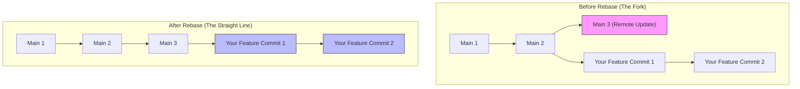
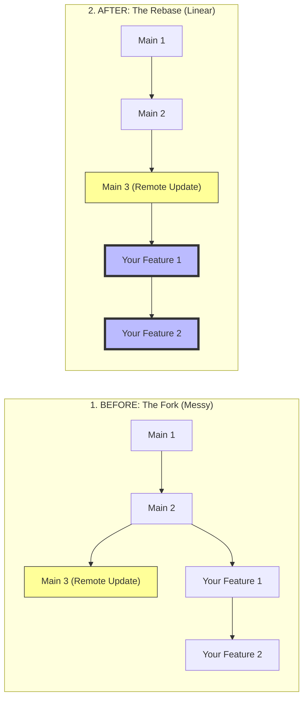

This creates a hard constraint: **You cannot touch the remote `main` branch directly.**

Since you are using GitHub with mandatory Pull Requests (likely with "Branch Protection Rules" enabled), your terminal workflow must change to serve the Pull Request, not the merge.

Here is your **GitHub Team Workflow Cheat Sheet**. This sequence aligns perfectly with the "Bridge" diagram I created above.

### The GitHub Team Workflow (Command by Command)

#### Phase 1: Start Clean (The Setup)

Do not branch off your local `main`. It is likely outdated. Branch off the *remote* reality.

```bash
# 1. Update your knowledge of the remote repo
git fetch origin

# 2. Create your branch based strictly on the current remote production code
git checkout -b feature/login-fix origin/main
```

#### Phase 2: The Work Loop

Work as usual. Save files.

```bash
# 3. Stage specific changes (Best practice: interactive staging)
git add -p 
# (Type 'y' to stage a chunk, 'n' to skip)

# 4. Commit to your local feature branch
git commit -m "feat: implement login button validation"
```

#### Phase 3: The Safety Sync (Crucial)

Before you push, check if your teammates merged anything into `main` while you were working.

```bash
# 5. Get latest updates again
git fetch origin

# 6. Replay your work on top of their work
git rebase origin/main
```

  * **Why?** If there are conflicts, you fix them here on your machine. If you don't do this, your Pull Request on GitHub will say "This branch has conflicts" and you'll have to fix it later anyway.

#### Phase 4: The Handoff

Push your branch to GitHub.

```bash
# 7. Push your branch and set the tracking reference
git push -u origin feature/login-fix
```

  * *Action:* Go to GitHub.com. You will see a banner: **"feature/login-fix had recent pushes. Compare & Pull Request."** Click that button.

#### Phase 5: Cleanup (After Merge)

Once your team approves and merges your PR on GitHub (using Squash & Merge), your local branch is trash. Delete it.

```bash
# 8. Switch back to main
git checkout main

# 9. Update local main to match the new reality on GitHub
git pull origin main

# 10. Delete the now-merged feature branch
git branch -d feature/login-fix
```

-----

### Summary of the Strategy Logic

| Step | Action | Logic / Validation |
| :--- | :--- | :--- |
| **Start** | `checkout ... origin/main` | Ensures you don't inherit junk from an old local main. |
| **Sync** | `rebase origin/main` | Ensures your PR is "Green" (no conflicts) before you even open it. |
| **Push** | `git push feature` | Triggers the GitHub interface for Code Review. |
| **Merge** | **GitHub UI** | Enforces team policies (Tests/Approvals) before code hits Prod. |

### Next Step

The scariest part of this workflow for most people is **Step 6** (`git rebase`).

Would you like me to explain exactly **how to resolve a conflict** if the rebase stops and screams at you?

---

You hit the nail on the head. Moving the conflict resolution **left** (to your local machine, before sharing) is the hallmark of a senior developer.

When you resolve conflicts during a `rebase`, you are essentially saying: *"I acknowledge the team has moved forward, and I am adapting my new feature to fit perfectly onto their latest work."*

Here is the visual mental model of what you are doing, followed by the **"Emergency Protocol"** for when a rebase actually hits a conflict.

### The Rebase Maneuver: The Mental Model

When you run `git rebase origin/main`, you are essentially "lifting" your commits and placing them at the front of the train.



-----

### The "Don't Panic" Protocol: Handling Rebase Conflicts

The reason people fear rebase is that the terminal "stops" in the middle of the process. It feels like an error, but it is just a question.

Here is your step-by-step guide for when the terminal says `CONFLICT (content): Merge conflict in file.js`.

#### 1\. Identify the Problem

The terminal hangs. Don't close it.

```bash
git status
# It will list "both modified: file.js" in red.
```

#### 2\. Fix the File

Open `file.js` in your code editor (VS Code, etc.). You will see this:

```javascript
<<<<<<< HEAD
const buttonColor = 'blue'; // This is what the Team did (Origin/Main)
=======
const buttonColor = 'red';  // This is what You did (Your Feature)
>>>>>>> feat: implement login button validation
```

  * **Action:** Delete the markers (`<<<<`, `====`, `>>>>`) and choose the correct code (or combine them).
  * **Save** the file.

#### 3\. Mark as Resolved

Tell Git you fixed it.

```bash
git add file.js
```

#### 4\. Continue (Crucial Step\!)

**Do not** run `git commit`. You are in the middle of a rebase "replay." You just need to hit play again.

```bash
git rebase --continue
```

  * *Git will now move to your next commit. If there are more conflicts, repeat steps 1-4. If not, it will say "Successfully rebased".*

-----

### One Golden Rule

There is only one way to mess this up, and I want to warn you about it now so you are safe:

> **⚠️ Never rebase a branch that your colleagues are also working on.**

If you and a colleague are *both* pushing code to `feature/login-fix`, and you run a rebase, you will rewrite the history that they rely on. **Rebase is for your private, local feature branch only.**

### Next Step

To make this seamless, I can provide you with a **`git config` setup** that configures VS Code as your default editor for Git. This way, when a conflict happens, Git creates a nice visual interface in VS Code automatically, rather than making you hunt for `<<<< HEAD` markers manually.

Would you like that configuration command?

---

You hit the nail on the head. Moving the conflict resolution **left** (to your local machine, before sharing) is the hallmark of a senior developer.

When you resolve conflicts during a `rebase`, you are essentially saying: *"I acknowledge the team has moved forward, and I am adapting my new feature to fit perfectly onto their latest work."*

Here is the visual mental model of what you are doing, followed by the **"Emergency Protocol"** for when a rebase actually hits a conflict.

### The Rebase Maneuver: The Mental Model

When you run `git rebase origin/main`, you are essentially "lifting" your commits and placing them at the front of the train.

I apologize for the rendering error. Mermaid diagrams can be finicky with parentheses `()` inside labels.

Here is the **corrected** visualization of the "Rebase Maneuver." I have switched the orientation to **Left-to-Right** because it better visualizes the "Train Track" timeline.

### The Rebase Mental Model: "Lift and Shift"

When you rebase, you are literally unplugging your feature branch from the old commit it started on, and plugging it into the very tip of the updated main branch.
I apologize for the syntax error. Mermaid diagrams can be very sensitive to parentheses `()` inside node labels.

Here is the **corrected, syntax-safe diagram** for the "Lift and Shift" mental model.

### The Rebase Maneuver: "Lift and Shift"

When you run `git rebase origin/main`, you are unplugging your feature branch from where it started (the old code) and plugging it into the tip of the train (the new code).



### Why this works for Teams

1.  **No "Merge Bubbles":** The history looks like you wrote your code *after* your colleague finished theirs.
2.  **Conflict Clarity:** You resolve conflicts against the latest code immediately, rather than discovering them weeks later during a merge.

-----

### The "Expert" Setup: Automation Aliases

Since you liked the idea of "best practices" and "handy commands," here is the final piece of the puzzle. These **Git Aliases** will automate your workflow so you don't have to type long commands.

Copy and paste these into your terminal:

#### 1\. `git sync` (The Safety Net)

Use this while working to pull latest changes and rebase your feature on top of them.

```bash
git config --global alias.sync '!git fetch origin && git rebase origin/main'
```

#### 2\. `git done` (The Cleanup)

Use this **after** your Pull Request is merged on GitHub. It switches you back to main and updates it, ready for the next ticket.

```bash
git config --global alias.done '!git checkout main && git pull origin main'
```

### How your day looks now:

1.  **Start:** `git checkout -b feature/x origin/main`
2.  **Work:** `git add -p` -\> `git commit -m "..."`
3.  **Update:** `git sync` (Fix conflicts in VS Code if any)
4.  **Push:** `git push -u origin feature/x` -\> **Open PR**
5.  **Finish:** `git done` -\> `git branch -d feature/x`

### Next Step

Would you like to know how to use `git commit --amend`? It is a powerful trick to fix a typo in your last commit message without creating a new "oops" commit.

### Why this is the "Best Practice"

  * **Before (Top):** If you merged now, you would create a "diamond" shape in the history (a merge bubble). If 10 developers do this, the history looks like a bowl of spaghetti.
  * **After (Bottom):** Your work looks like it was written *after* the latest update arrived. It creates a straight line.

-----

### The "One-Command" Solution (Git Alias)

Since you validated that this strategy (Rebase + One Developer per Branch) is exactly what you need, let's make the "Safety Sync" step effortless.

Instead of typing `git fetch origin` and then `git rebase origin/main` every time, we can create a custom command: **`git sync`**.

Run this command in your terminal once:

```bash
git config --global alias.sync '!git fetch origin && git rebase origin/main'
```

### How to use it now:

1.  **Code & Commit:** `git commit -m "wip"`
2.  **Sync:** `git sync` (This performs the fetch and rebase automatically)
3.  **Push:** `git push -u origin feature/x`

**Next Step:**
Would you like the **"Cleanup Alias"** as well? I can give you a `git done` command that switches you to main, pulls the latest code, and deletes your old feature branch in one go.

-----

### The "Don't Panic" Protocol: Handling Rebase Conflicts

The reason people fear rebase is that the terminal "stops" in the middle of the process. It feels like an error, but it is just a question.

Here is your step-by-step guide for when the terminal says `CONFLICT (content): Merge conflict in file.js`.

#### 1\. Identify the Problem

The terminal hangs. Don't close it.

```bash
git status
# It will list "both modified: file.js" in red.
```

#### 2\. Fix the File

Open `file.js` in your code editor (VS Code, etc.). You will see this:

```javascript
<<<<<<< HEAD
const buttonColor = 'blue'; // This is what the Team did (Origin/Main)
=======
const buttonColor = 'red';  // This is what You did (Your Feature)
>>>>>>> feat: implement login button validation
```

  * **Action:** Delete the markers (`<<<<`, `====`, `>>>>`) and choose the correct code (or combine them).
  * **Save** the file.

#### 3\. Mark as Resolved

Tell Git you fixed it.

```bash
git add file.js
```

#### 4\. Continue (Crucial Step\!)

**Do not** run `git commit`. You are in the middle of a rebase "replay." You just need to hit play again.

```bash
git rebase --continue
```

  * *Git will now move to your next commit. If there are more conflicts, repeat steps 1-4. If not, it will say "Successfully rebased".*

-----

### One Golden Rule

There is only one way to mess this up, and I want to warn you about it now so you are safe:

> **⚠️ Never rebase a branch that your colleagues are also working on.**

If you and a colleague are *both* pushing code to `feature/login-fix`, and you run a rebase, you will rewrite the history that they rely on. **Rebase is for your private, local feature branch only.**

### Next Step

To make this seamless, I can provide you with a **`git config` setup** that configures VS Code as your default editor for Git. This way, when a conflict happens, Git creates a nice visual interface in VS Code automatically, rather than making you hunt for `<<<< HEAD` markers manually.

Would you like that configuration command?
