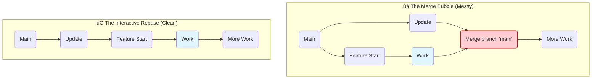
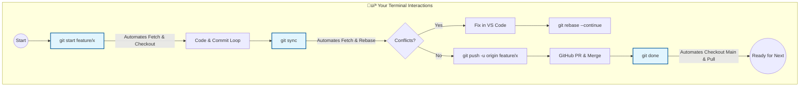

Here is your production-ready `TEAM_GIT_GUIDE.md`. You can copy the raw code below and add it directly to your project's root directory.

It is written to be onboard-friendly, meaning a new developer joining your team can read this and immediately start working the "right way."

-----

````markdown
# üìò Team Git Workflow & Best Practices

This guide outlines our team's strategy for managing code. We use a **Rebase-Heavy / Trunk-Based** workflow to keep our history clean, linear, and conflict-free.

## ‚ö° Quick Setup (The "Power Kit")

To make this workflow effortless, we use custom Git Aliases. Run this entire block in your terminal once to set up your machine:

```bash
# 1. START: Fetch latest remote code and switch to a new branch
git config --global alias.start '!git fetch origin && git checkout -b'

# 2. WIP: Panic save with a timestamp (great for context switching)
git config --global alias.wip '!git add . && git commit -m "wip: $(date +\"%Y-%m-%d %H:%M:%S\")"'

# 3. FIX: Add forgotten files to the last commit without changing the message
git config --global alias.fix '!git add . && git commit --amend --no-edit'

# 4. ORGANIZE: Interactively squash your local commits before sharing
git config --global alias.organize '!git rebase -i origin/main'

# 5. SYNC: The Safety Net - Fetch & Rebase on top of team's latest work
git config --global alias.sync '!git fetch origin && git rebase origin/main'

# 6. DONE: Return to main, update it, and prune deleted remote branches
git config --global alias.done '!git checkout main && git pull origin main && git fetch -p'
````

-----

## üõ§ The Workflow Strategy

Our goal: **Linear History.** We avoid "merge bubbles" by rebasing local work onto `origin/main` before pushing.


-----

## üìù Step-by-Step Guide

### 1\. Start Clean (`git start`)

Never branch off your local `main` (it is likely outdated). Always branch off the remote reality.

```bash
git start feature/user-login
# Equivalent to: git fetch origin && git checkout -b feature/user-login origin/main
```

### 2\. The Dev Loop (`git wip` / `git fix`)

Work freely. Don't worry about messy history yet.

  * **Need to switch tasks quickly?** Run `git wip`. It saves everything with a timestamp.
  * **Forgot a file in the last commit?** Stage it and run `git fix`.

### 3\. Cleanup (`git organize`)

**Before you share your code**, tidy up your room.

```bash
git organize
```

  * This opens your editor list of commits.
  * Keep the top commit as `pick`.
  * Change `pick` to `s` (squash) for all the "wip" commits you want to merge into the main feature commit.

### 4\. The Safety Sync (`git sync`)

**Crucial:** Check if the team updated `main` while you were working.

```bash
git sync
```

  * This fetches `origin/main` and replays your work on top of it.
  * **If Conflicts Arise:**
    1.  Fix the files in VS Code.
    2.  `git add .`
    3.  `git rebase --continue`

### 5\. Push & PR

Now that your history is clean and linear, push it.

```bash
git push -u origin feature/user-login
```

  * Go to GitHub/GitLab and open the Pull Request.

### 6\. Finish (`git done`)

Once your PR is merged:

```bash
git done
# Switches to main, pulls latest code, and prunes remote references.
```

  * *Optional:* Delete your local branch: `git branch -d feature/user-login`

-----

## 🆘 Troubleshooting

**"I'm scared of the rebase conflict\!"**
Don't be. A conflict during rebase is just Git asking: *"The team changed line 10, but you also changed line 10. Which one do you want?"*

**Recommended:** Set VS Code as your default conflict solver to make this visual:

```bash
git config --global core.editor "code --wait"
git config --global merge.tool vscode
git config --global mergetool.vscode.cmd 'code --wait $MERGED'
```

### A Next Step for You

Since we have created a complete ecosystem (Workflow + Diagram + Documentation + Aliases), the **best next step** is to apply this to your current project immediately.

---

This is a classic scenario. We call it **"The Spaghetti Incident."**

You are working on your feature, you want to update your code, but instead of our nice `git sync` (rebase), you accidentally type `git merge origin/main`.

Suddenly, your history splits into two tracks and joins back together. If you do this multiple times, your history looks like a guitar hero track.

Here is how to fix the "Merge Bubble" and return to a straight line using your new tool: `git organize`.

### The Problem: The Accidental "Merge Bubble"

Visually, here is what happens when you merge instead of rebase. It creates a "foreign" commit (the merge commit) that pollutes your feature history.



-----

### The Solution: `git organize` to the Rescue

The beautiful thing about `git organize` (which runs `git rebase -i origin/main`) is that **Git is smart enough to know that merge commits do not belong in a linear history.**

When you run the command, Git looks at your history, sees the "Merge Bubble," and often **automatically deletes it** from the list of tasks.

#### Step 1: Run the command

```bash
git organize
```

#### Step 2: The Editor Opens (The "God Mode" View)

You will see a text file listing all your commits.

  * **Look closely:** The commit named "Merge branch 'main' into..." is likely **MISSING**. Git removed it for you\!
  * If you *do* see the merge commit line, simply **delete that line** (this is called "dropping" the commit).

You will effectively see your messy history converted into a clean list:

```text
pick 1234567 feat: login page styling
pick 890abcd wip: temp save
pick efghijk Merge branch 'main' into feature/x  <-- DELETE THIS LINE IF YOU SEE IT!
pick lmnopq2 fix: typo
```

#### Step 3: Clean it up

Now, you do the standard squash routine to make it pretty.

1.  **Delete/Drop** the Merge commit line (if present).
2.  Change `pick` to `s` (squash) for the WIPs and Fixes.

<!-- end list -->

```text
pick 1234567 feat: login page styling
s    890abcd wip: temp save
s    lmnopq2 fix: typo
```

#### Step 4: Save and Close

Git will rewind time, apply your changes, **skip the merge bubble**, and squash your work.

  * *Result:* You are now sitting on top of `main` with a perfectly straight history.

-----

### üöë Emergency Plan B: The "Nuclear Option"

Sometimes, the history is *so* messy (multiple merges, conflicts resolved in weird ways) that `git organize` gets confused and throws errors.

If you feel stuck, use the **"Soft Reset"** maneuver. This is the ultimate "Undo" button for Senior Engineers.

**The Logic:** "I don't care about the history anymore. I just want to keep my files as they are right now, but reset the Git history to match `main`."

```bash
# 1. Ensure you are on your feature branch
git checkout feature/x

# 2. Reset the HISTORY to origin/main, but keep your FILES (changes) staged
git reset --soft origin/main

# 3. Commit everything as one fresh, clean commit
git commit -m "feat: login page complete"

# 4. Force push (because you rewrote history)
git push -f origin feature/x
```

**What just happened?**
You teleported your branch pointer back to `main`, but you kept all your code changes in your "backpack" (Staging Area). Then you made one single, beautiful commit. The merge bubbles are gone forever.

### Final Interaction

You now have the **Workflow**, the **Aliases**, the **Docs**, and the **Emergency Repair Tools**.

Would you like me to wish you good luck, or is there one final Git scenario (like "Stashing") that keeps you up at night?
---

Yes, you are absolutely right. Using **Git Aliases** is the professional way to enforce this strategy. It reduces cognitive load, prevents typos, and turns a complex 3-step "best practice" into a simple 1-step action.

Here is your **"Smart Alias Toolkit"** that maps directly to the optimal strategy we designed.

### The 3 "Power Aliases" for your Workflow

Copy and paste these command blocks into your terminal. They will add shortcuts to your `.gitconfig`.

#### 1\. The `git start` (For Step 1 & 2)

Instead of typing `git fetch` then `git checkout -b ...`, this does both. It ensures you **always** start from the latest remote code, not your stale local main.

```bash
git config --global alias.start '!git fetch origin && git checkout -b'
```

  * **Usage:** `git start feature/login-fix`
  * **Logic:** Fetches latest data -\> Creates new branch pointing to `origin/main`.

#### 2\. The `git sync` (For Step 4 - The Rebase)

This is the most critical alias. It automates the "Pull & Rebase" dance.

```bash
git config --global alias.sync '!git fetch origin && git rebase origin/main'
```

  * **Usage:** `git sync`
  * **Logic:** Updates references -\> Lifts your commits -\> Places them on top of the team's latest work.

#### 3\. The `git done` (For Step 8 - Cleanup)

After your Pull Request is merged on GitHub, this gets you back to safety.

```bash
# Switches to main, updates it, and cleans up deleted remote branches
git config --global alias.done '!git checkout main && git pull origin main && git fetch -p'
```

  * **Usage:** `git done`
  * **Logic:** Go to main -\> Get latest production code -\> Prune (remove) references to branches that no longer exist on the server. (Note: You still manually delete your local feature branch with `git branch -d feature-name` to be safe).

-----

### The Workflow Visualized with Aliases

Here is how your daily life looks using these new commands. It is much cleaner.



### Detailed Breakdown of the "Smart" Logic

| Command | What you type | What Git actually does (The Grouped Command) | Why it's better |
| :--- | :--- | :--- | :--- |
| **Start** | `git start feature-x` | `git fetch origin`<br>`git checkout -b feature-x origin/main` | Prevents accidentally branching off an outdated local main. |
| **Sync** | `git sync` | `git fetch origin`<br>`git rebase origin/main` | One word to keep your history linear. Removes the fear of complex command flags. |
| **Done** | `git done` | `git checkout main`<br>`git pull origin main`<br>`git fetch -p` | Ensures you are back on production code instantly. |

### Next Step

There is one final "Pro Tip" regarding **Step 2.1 (git add)**.

Do you find yourself typing `git add .` often? I can show you how to use `git add -p` (patch mode) effectively, or give you an alias for a "Work in Progress" commit (`git wip`) if you just want to save everything quickly without thinking?

---


This creates a hard constraint: **You cannot touch the remote `main` branch directly.**

Since you are using GitHub with mandatory Pull Requests (likely with "Branch Protection Rules" enabled), your terminal workflow must change to serve the Pull Request, not the merge.

Here is your **GitHub Team Workflow Cheat Sheet**. This sequence aligns perfectly with the "Bridge" diagram I created above.

### The GitHub Team Workflow (Command by Command)

#### Phase 1: Start Clean (The Setup)

Do not branch off your local `main`. It is likely outdated. Branch off the *remote* reality.

```bash
# 1. Update your knowledge of the remote repo
git fetch origin

# 2. Create your branch based strictly on the current remote production code
git checkout -b feature/login-fix origin/main
```

#### Phase 2: The Work Loop

Work as usual. Save files.

```bash
# 3. Stage specific changes (Best practice: interactive staging)
git add -p 
# (Type 'y' to stage a chunk, 'n' to skip)

# 4. Commit to your local feature branch
git commit -m "feat: implement login button validation"
```

#### Phase 3: The Safety Sync (Crucial)

Before you push, check if your teammates merged anything into `main` while you were working.

```bash
# 5. Get latest updates again
git fetch origin

# 6. Replay your work on top of their work
git rebase origin/main
```

  * **Why?** If there are conflicts, you fix them here on your machine. If you don't do this, your Pull Request on GitHub will say "This branch has conflicts" and you'll have to fix it later anyway.

#### Phase 4: The Handoff

Push your branch to GitHub.

```bash
# 7. Push your branch and set the tracking reference
git push -u origin feature/login-fix
```

  * *Action:* Go to GitHub.com. You will see a banner: **"feature/login-fix had recent pushes. Compare & Pull Request."** Click that button.

#### Phase 5: Cleanup (After Merge)

Once your team approves and merges your PR on GitHub (using Squash & Merge), your local branch is trash. Delete it.

```bash
# 8. Switch back to main
git checkout main

# 9. Update local main to match the new reality on GitHub
git pull origin main

# 10. Delete the now-merged feature branch
git branch -d feature/login-fix
```

-----

### Summary of the Strategy Logic

| Step | Action | Logic / Validation |
| :--- | :--- | :--- |
| **Start** | `checkout ... origin/main` | Ensures you don't inherit junk from an old local main. |
| **Sync** | `rebase origin/main` | Ensures your PR is "Green" (no conflicts) before you even open it. |
| **Push** | `git push feature` | Triggers the GitHub interface for Code Review. |
| **Merge** | **GitHub UI** | Enforces team policies (Tests/Approvals) before code hits Prod. |

### Next Step

The scariest part of this workflow for most people is **Step 6** (`git rebase`).

Would you like me to explain exactly **how to resolve a conflict** if the rebase stops and screams at you?

---

You hit the nail on the head. Moving the conflict resolution **left** (to your local machine, before sharing) is the hallmark of a senior developer.

When you resolve conflicts during a `rebase`, you are essentially saying: *"I acknowledge the team has moved forward, and I am adapting my new feature to fit perfectly onto their latest work."*

Here is the visual mental model of what you are doing, followed by the **"Emergency Protocol"** for when a rebase actually hits a conflict.

### The Rebase Maneuver: The Mental Model

When you run `git rebase origin/main`, you are essentially "lifting" your commits and placing them at the front of the train.


-----

### The "Don't Panic" Protocol: Handling Rebase Conflicts

The reason people fear rebase is that the terminal "stops" in the middle of the process. It feels like an error, but it is just a question.

Here is your step-by-step guide for when the terminal says `CONFLICT (content): Merge conflict in file.js`.

#### 1\. Identify the Problem

The terminal hangs. Don't close it.

```bash
git status
# It will list "both modified: file.js" in red.
```

#### 2\. Fix the File

Open `file.js` in your code editor (VS Code, etc.). You will see this:

```javascript
<<<<<<< HEAD
const buttonColor = 'blue'; // This is what the Team did (Origin/Main)
=======
const buttonColor = 'red';  // This is what You did (Your Feature)
>>>>>>> feat: implement login button validation
```

  * **Action:** Delete the markers (`<<<<`, `====`, `>>>>`) and choose the correct code (or combine them).
  * **Save** the file.

#### 3\. Mark as Resolved

Tell Git you fixed it.

```bash
git add file.js
```

#### 4\. Continue (Crucial Step\!)

**Do not** run `git commit`. You are in the middle of a rebase "replay." You just need to hit play again.

```bash
git rebase --continue
```

  * *Git will now move to your next commit. If there are more conflicts, repeat steps 1-4. If not, it will say "Successfully rebased".*

-----

### One Golden Rule

There is only one way to mess this up, and I want to warn you about it now so you are safe:

> **⚠️ Never rebase a branch that your colleagues are also working on.**

If you and a colleague are *both* pushing code to `feature/login-fix`, and you run a rebase, you will rewrite the history that they rely on. **Rebase is for your private, local feature branch only.**

### Next Step

To make this seamless, I can provide you with a **`git config` setup** that configures VS Code as your default editor for Git. This way, when a conflict happens, Git creates a nice visual interface in VS Code automatically, rather than making you hunt for `<<<< HEAD` markers manually.

Would you like that configuration command?

---

You hit the nail on the head. Moving the conflict resolution **left** (to your local machine, before sharing) is the hallmark of a senior developer.

When you resolve conflicts during a `rebase`, you are essentially saying: *"I acknowledge the team has moved forward, and I am adapting my new feature to fit perfectly onto their latest work."*

Here is the visual mental model of what you are doing, followed by the **"Emergency Protocol"** for when a rebase actually hits a conflict.

### The Rebase Maneuver: The Mental Model

When you run `git rebase origin/main`, you are essentially "lifting" your commits and placing them at the front of the train.

I apologize for the rendering error. Mermaid diagrams can be finicky with parentheses `()` inside labels.

Here is the **corrected** visualization of the "Rebase Maneuver." I have switched the orientation to **Left-to-Right** because it better visualizes the "Train Track" timeline.

### The Rebase Mental Model: "Lift and Shift"

When you rebase, you are literally unplugging your feature branch from the old commit it started on, and plugging it into the very tip of the updated main branch.
I apologize for the syntax error. Mermaid diagrams can be very sensitive to parentheses `()` inside node labels.

Here is the **corrected, syntax-safe diagram** for the "Lift and Shift" mental model.

### The Rebase Maneuver: "Lift and Shift"

When you run `git rebase origin/main`, you are unplugging your feature branch from where it started (the old code) and plugging it into the tip of the train (the new code).


### Why this works for Teams

1.  **No "Merge Bubbles":** The history looks like you wrote your code *after* your colleague finished theirs.
2.  **Conflict Clarity:** You resolve conflicts against the latest code immediately, rather than discovering them weeks later during a merge.

-----

### The "Expert" Setup: Automation Aliases

Since you liked the idea of "best practices" and "handy commands," here is the final piece of the puzzle. These **Git Aliases** will automate your workflow so you don't have to type long commands.

Copy and paste these into your terminal:

#### 1\. `git sync` (The Safety Net)

Use this while working to pull latest changes and rebase your feature on top of them.

```bash
git config --global alias.sync '!git fetch origin && git rebase origin/main'
```

#### 2\. `git done` (The Cleanup)

Use this **after** your Pull Request is merged on GitHub. It switches you back to main and updates it, ready for the next ticket.

```bash
git config --global alias.done '!git checkout main && git pull origin main'
```

### How your day looks now:

1.  **Start:** `git checkout -b feature/x origin/main`
2.  **Work:** `git add -p` -\> `git commit -m "..."`
3.  **Update:** `git sync` (Fix conflicts in VS Code if any)
4.  **Push:** `git push -u origin feature/x` -\> **Open PR**
5.  **Finish:** `git done` -\> `git branch -d feature/x`

### Next Step

Would you like to know how to use `git commit --amend`? It is a powerful trick to fix a typo in your last commit message without creating a new "oops" commit.

### Why this is the "Best Practice"

  * **Before (Top):** If you merged now, you would create a "diamond" shape in the history (a merge bubble). If 10 developers do this, the history looks like a bowl of spaghetti.
  * **After (Bottom):** Your work looks like it was written *after* the latest update arrived. It creates a straight line.

-----

### The "One-Command" Solution (Git Alias)

Since you validated that this strategy (Rebase + One Developer per Branch) is exactly what you need, let's make the "Safety Sync" step effortless.

Instead of typing `git fetch origin` and then `git rebase origin/main` every time, we can create a custom command: **`git sync`**.

Run this command in your terminal once:

```bash
git config --global alias.sync '!git fetch origin && git rebase origin/main'
```

### How to use it now:

1.  **Code & Commit:** `git commit -m "wip"`
2.  **Sync:** `git sync` (This performs the fetch and rebase automatically)
3.  **Push:** `git push -u origin feature/x`

**Next Step:**
Would you like the **"Cleanup Alias"** as well? I can give you a `git done` command that switches you to main, pulls the latest code, and deletes your old feature branch in one go.

-----

### The "Don't Panic" Protocol: Handling Rebase Conflicts

The reason people fear rebase is that the terminal "stops" in the middle of the process. It feels like an error, but it is just a question.

Here is your step-by-step guide for when the terminal says `CONFLICT (content): Merge conflict in file.js`.

#### 1\. Identify the Problem

The terminal hangs. Don't close it.

```bash
git status
# It will list "both modified: file.js" in red.
```

#### 2\. Fix the File

Open `file.js` in your code editor (VS Code, etc.). You will see this:

```javascript
<<<<<<< HEAD
const buttonColor = 'blue'; // This is what the Team did (Origin/Main)
=======
const buttonColor = 'red';  // This is what You did (Your Feature)
>>>>>>> feat: implement login button validation
```

  * **Action:** Delete the markers (`<<<<`, `====`, `>>>>`) and choose the correct code (or combine them).
  * **Save** the file.

#### 3\. Mark as Resolved

Tell Git you fixed it.

```bash
git add file.js
```

#### 4\. Continue (Crucial Step\!)

**Do not** run `git commit`. You are in the middle of a rebase "replay." You just need to hit play again.

```bash
git rebase --continue
```

  * *Git will now move to your next commit. If there are more conflicts, repeat steps 1-4. If not, it will say "Successfully rebased".*

-----

### One Golden Rule

There is only one way to mess this up, and I want to warn you about it now so you are safe:

> **⚠️ Never rebase a branch that your colleagues are also working on.**

If you and a colleague are *both* pushing code to `feature/login-fix`, and you run a rebase, you will rewrite the history that they rely on. **Rebase is for your private, local feature branch only.**

### Next Step

To make this seamless, I can provide you with a **`git config` setup** that configures VS Code as your default editor for Git. This way, when a conflict happens, Git creates a nice visual interface in VS Code automatically, rather than making you hunt for `<<<< HEAD` markers manually.

Would you like that configuration command?
